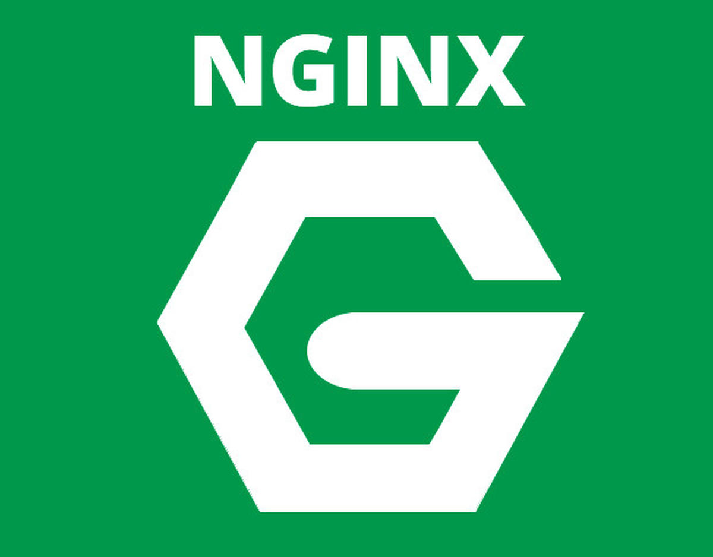
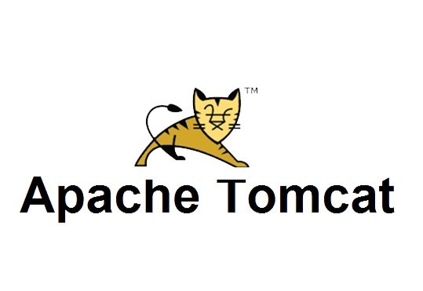

# Tool Evaluation

| **Author** | **Created on** | **Last updated by** |**Version**| **Last edited on** | **Internal Reviewer** | 
|------------|----------------|---------------------|-----------|--------------------|---------------|
| Sharvari Khamkar | 10-02-25      | Sharvari Khamkar         | v1 | 10-02-25       | Komal Jaiswal |  

## Table of Contents
1. [Purpose](#Purpose)
2. [Tools_List](#Tools_List)
3. [Tools Description](#Tools_Description)
4. [Pre-requirements Table](#Pre-requirements_Table)
5. [Comparison Table](#comparison-table)
6. [Strengths & Weaknesses](#strengths--weaknesses)
7. [Conclusion](#conclusion)
8. [Contacts](#Contacts)
9. [References](#references)

## Purpose
This document evaluates and compares Apache with its major competitors based on prerequisites, features, performance, strengths, and weaknesses.

## Tools-List
- **Apache**
- **Nginx**
- **Tomcat**
- **HAProxy**

## Tools Description

### Apache

A widely used open-source web server with extensive module support and easy configuration. Apache supports a vast array of plugins, allowing customization for different use cases. It is well-suited for dynamic content, supports .htaccess for per-directory configuration, and integrates well with multiple programming languages like PHP, Python, and Perl.

### Nginx

A high-performance, lightweight web server and reverse proxy designed for handling multiple concurrent connections efficiently. It is widely used for serving static content, load balancing, and reverse proxying. Nginx is known for its scalability and event-driven architecture, making it ideal for handling high traffic loads.

### Tomcat

A Java-based web server primarily used for running Java Servlets and JSP applications. It is widely used in enterprise environments for Java web applications, supporting Java EE specifications and web services.

### HAProxy

A highly efficient and reliable TCP/HTTP load balancer designed to optimize web performance and distribute traffic across multiple backend servers. It is commonly used for high-availability setups and scalability.

## Pre-requirements Table

| **Requirement**        | **Apache**            | **Nginx**             | **Tomcat**            | **HAProxy**           |
|-----------------------|---------------------|---------------------|---------------------|---------------------|
| **Operating System**  | Linux, Windows, macOS | Linux, Windows, macOS | Linux, Windows, macOS | Linux, Windows, macOS |
| **Installation Method** | Package Manager / Source | Package Manager / Source | Package Manager / Binary | Package Manager / Source |
| **Default Port**      | 80 (HTTP), 443 (HTTPS) | 80 (HTTP), 443 (HTTPS) | 8080 (HTTP) | 80 (HTTP), 443 (HTTPS) |
| **Configuration File** | `/etc/httpd/httpd.conf` | `/etc/nginx/nginx.conf` | `/conf/server.xml` | `/etc/haproxy/haproxy.cfg` |
| **Root Privileges**   | Required | Required | Required | Required |
| **Dependencies**      | APR, OpenSSL, PCRE | OpenSSL, PCRE, zlib | Java JDK | OpenSSL, zlib |
| **SSL/TLS Support**  | Manual | Manual | Manual | Manual |
| **Minimum RAM/CPU**  | 1GB RAM, 1 vCPU | 512MB RAM, 1 vCPU | 1GB RAM, 1 vCPU | 512MB RAM, 1 vCPU |

## Comparison Table

| Feature               | Apache                | Nginx                | Tomcat                | HAProxy               |
|----------------------|---------------------|---------------------|---------------------|---------------------|
| **Performance**      | Moderate, process/thread-based | High, event-driven | Moderate, Java-based | High, event-driven |
| **Ease of Use**      | Easy (Traditional config) | Moderate (Complex syntax) | Moderate (Java-specific) | Moderate (Config-based) |
| **Resource Usage**   | High                 | Low                 | Moderate             | Low                 |
| **Reverse Proxy**    | Yes (Via modules)    | Yes (Built-in)      | No                   | Yes (Optimized)     |
| **Load Balancing**   | Yes (Via modules)    | Yes (Built-in)      | No                   | Yes (Optimized)     |
| **Security**         | Moderate (Depends on modules) | High (Rate limiting, WAF) | High (Java security) | High (DDoS protection) |
| **HTTP/2 & HTTP/3**  | Yes (HTTP/2 only)    | Yes                 | No                   | Yes                 |
| **Community Support**| Large                | Large                | Large                | Medium              |
| **License**         | Open-source (FOSS)   | Open-source (FOSS)  | Open-source (FOSS)  | Open-source (FOSS)  |

## Strengths & Weaknesses

| **Web Server** | **Strengths** | **Weaknesses** |
|---------------|--------------|---------------|
| **Apache** | Extensive module support.  Strong community and documentation. | Higher memory and CPU consumption.  Slower under heavy concurrent load. |
| **Nginx** | High performance and scalability.  Low resource usage.  Built-in reverse proxy and load balancing. | Complex configuration syntax.  Less native support for dynamic content compared to Apache. |
| **Tomcat** | Optimized for Java web applications.  Good integration with Java frameworks. | Not suitable for static content.  Requires Java runtime. |
| **HAProxy** | Excellent load balancing.  Optimized for high availability.  Low resource consumption. | Configuration can be complex.  Limited support for dynamic content. |

## Conclusion
Apache remains a strong option due to its modularity and ease of use, while Nginx is better suited for high-performance web serving and reverse proxying. Tomcat is essential for Java-based applications, whereas HAProxy excels in load balancing and high availability scenarios. The right choice depends on specific use cases, such as ease of configuration, security, and scalability.

## Contacts

| Name| Email Address      | Contact Number      |
|-----|--------------------------|-----------------|
| Sharvari Khamkar |  sharvari.khamkar@mygurukulam.co | 9702636830 |

## References

| **Reference**                                    | **Description**                                                                  |
|--------------------------------------------------|----------------------------------------------------------------------------------|
| [Apache HTTP Server Docs](https://httpd.apache.org/docs/) | Apache Documentation |
| [Nginx Official Docs](https://nginx.org/en/docs/) | Nginx Documentation |
| [Tomcat Documentation](https://tomcat.apache.org/tomcat-9.0-doc/) | Tomcat Documentation |
| [HAProxy Official Site](http://www.haproxy.org/) | HAProxy Documentation |
| [Web Server Benchmarks](https://www.linode.com/docs/guides/nginx-vs-apache-vs-haproxy/) | Benchmark Comparisons |
